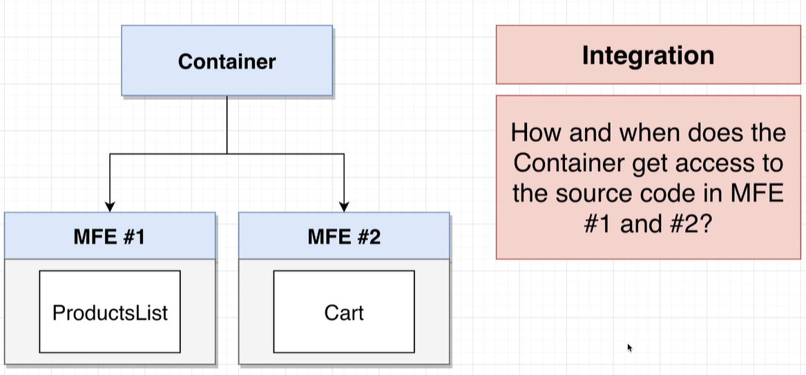

# Microfrontends

Separate major features in separate repos. Direct communication between
features is avoided. Communication is implemented via the backend.

Each of those pieces could then be assigned to separate developer teams.

There is a container app in addition to the microfrontends, that decides
which app should be displayed.

Will be focusing on run-time integration as that is far more complicated.

We choose a container that integrates the other library.
ModuleFederationPlugin can be used to expose files to the other
process. And then the same plugin can be used to connect the container to
the dependency.

A dependency provides several configuration options that define the name of 
files that are exposed to the container file.
* `name` provides the name for the module with which it will be referenced
from the parent container along with its URL and filename.
* `filename` defines the file name that contains the list of files that
are available from the project and directions on how to load them.
* `exposes` defines the files that are exposed and what is the alias for them.
Left side being the alias and the right side being the file that is
exposed.

When the dependency is being loaded, then several files are loaded. First the
file that is defined using `filename`. In the example it is 
`listOfFilesThatAreAvailableFromThisProjectAndDirectionsOnHowToLoadThem.js`. 
This gives instructions on how to bind the custom code and dependencies together.
Then there is the file that contains our exposed code in the format of 
`<folderStructure>_<exposedFileName>_js.js`. So in our example `src_fileNameToExposeInProducts_js.js`.
If our file would be more deeply nested, for example `src/nesting/fileNameToExposeInProducts.js`, then
the file name would be `src_nesting_fileNameToExposeInProducts_js.js`.
Finally, is a file related to the dependencies.

The dependency also spits out the main file in addition to those so that it could
still be loaded standalone.

The consuming container has to then include the dependency. It defines the name of the module,
same as the dependency. Additionally, it provides the `remotes` property, which defines the
alias of the dependency, with which we can refer to it in the container project. In our example 
it is the `products` object key. It then defines the target from which the code is got. The source
is in the format of `<definedProjectNameInTheDependency>@<projectDeployedDomain>/<definedFileNameInDependency>`.
So the example in our project is 
`nameOfTheProductsProject@http://localhost:8081/listOfFilesThatAreAvailableFromThisProjectAndDirectionsOnHowToLoadThem.js`.
This is because we defined the `name` property in our dependency as `nameOfTheProductsProject`. We had it deployed on
`http://localhost:8081` and the `filename` property in our dependency as 
`listOfFilesThatAreAvailableFromThisProjectAndDirectionsOnHowToLoadThem.js`.

Now when the consuming container wants to actually add it, it has to separate it with an async call. This allows us to 
tell Webpack that it has to get some code that has to queried from an external source. You can have either
your own file that you call async. In our example `import ('./bootstrap');` from `index.js`. Then we can add the external
dependency as a regular sync import. This would add easier handling for the dependency if we want to add our custom logic.
Alternatively, we can add a direct async import to the external dependency, thus not needing the middle layer of our own
file, so `import ('products/AliasForExposedIndexFileFromProducts');` from `index.js`.

So the entire execution flow looks like this.

1. When we open up the container app, then `main.js` is loaded an executed.
2. `main.js` contains a line that says we need to asynchronously get `bootstrap.js` and execute it.
3. It then sees that `bootstrap.js` requires a file from the `products` project. It fetches 
`listOfFilesThatAreAvailableFromThisProjectAndDirectionsOnHowToLoadThem.js` to figure out how to fetch that required file.
4. The file tells our app that it requires `fileNameToExposeInProducts.js` and the `faker.js` dependency.
5. Get both of those, fetch and execute `bootstrap.js`.
